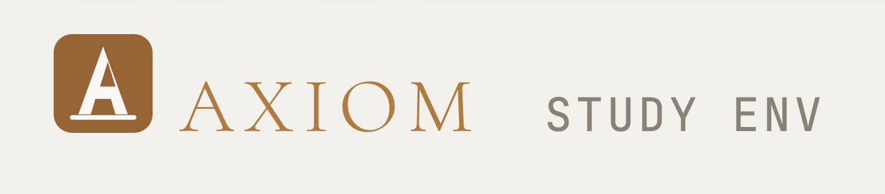
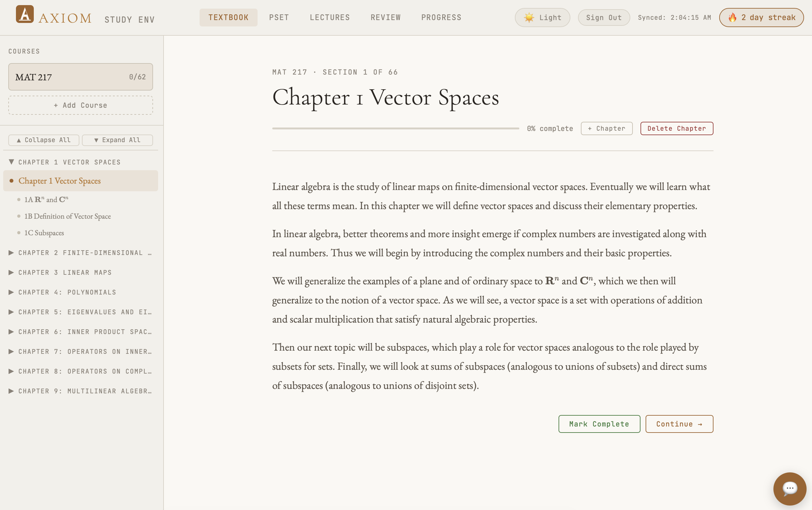
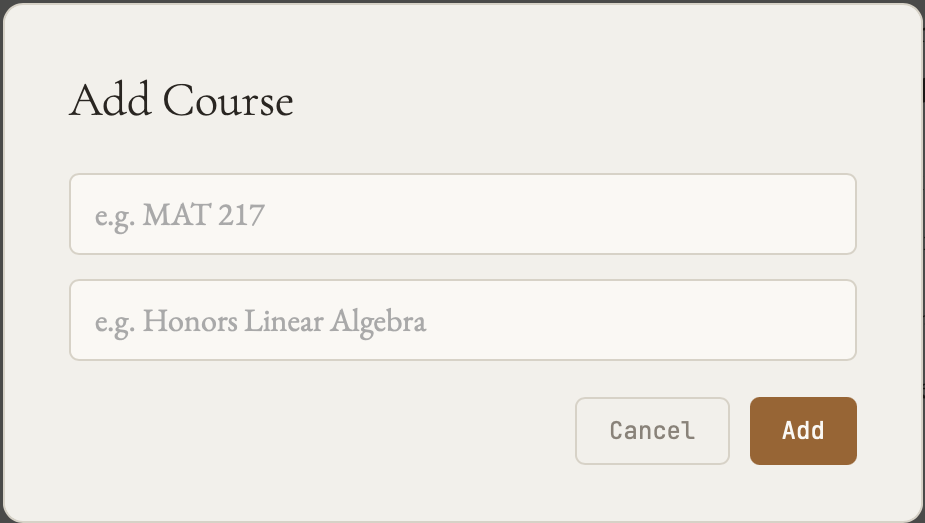
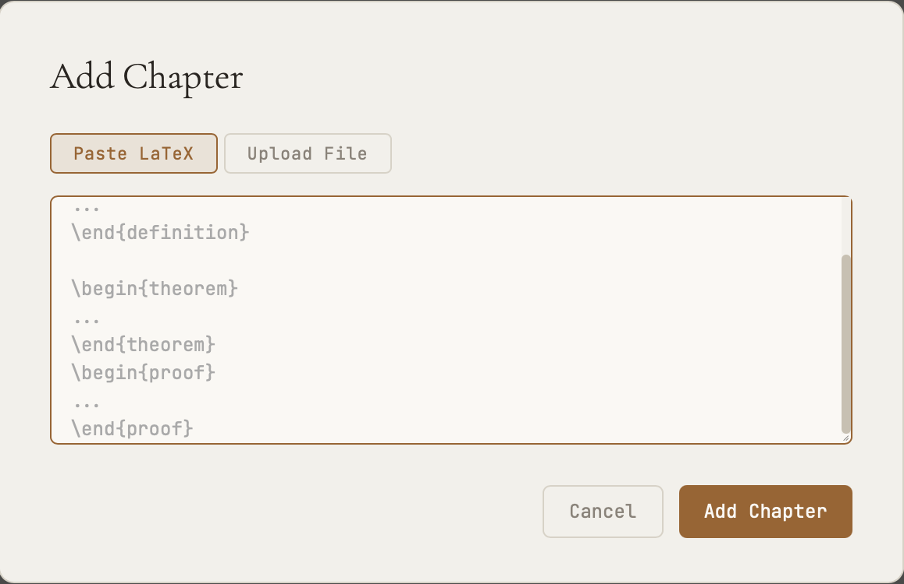
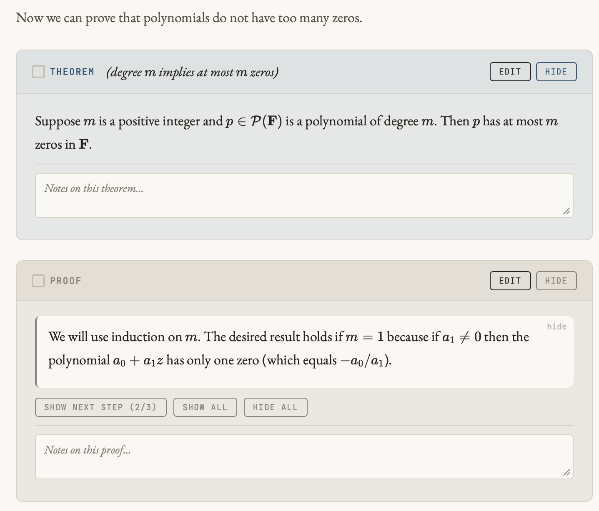
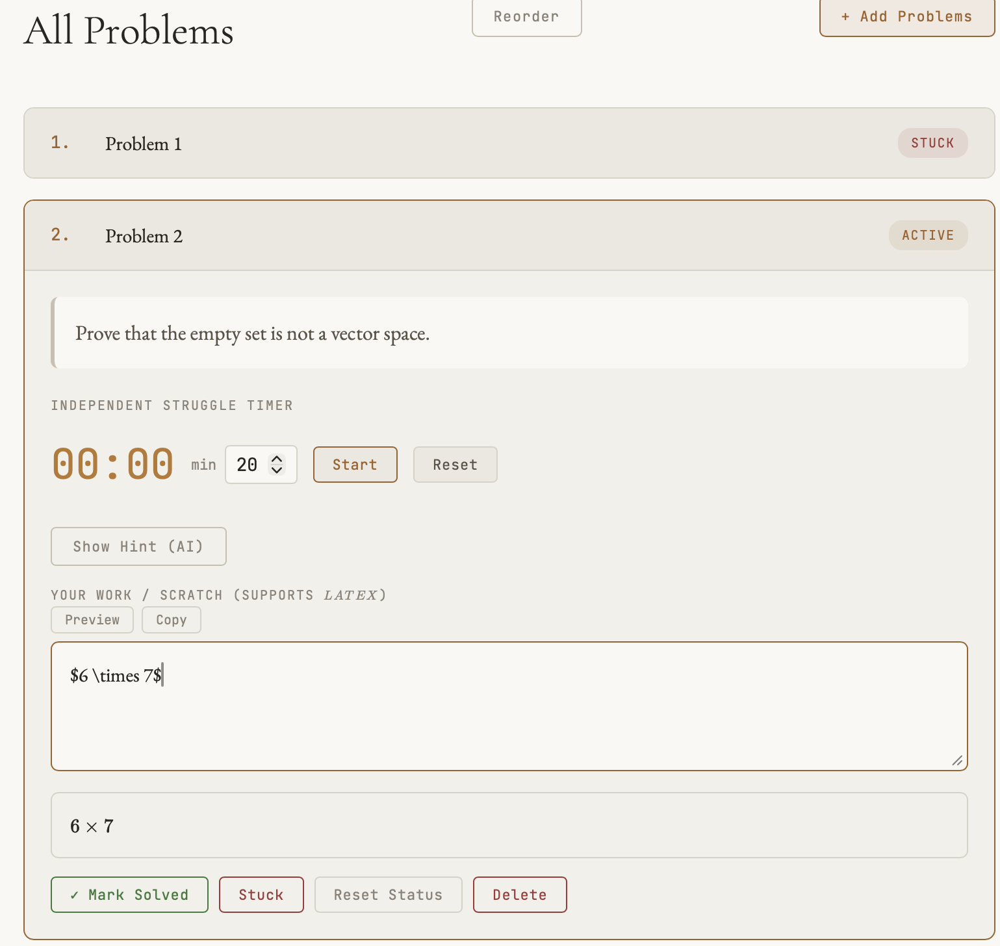
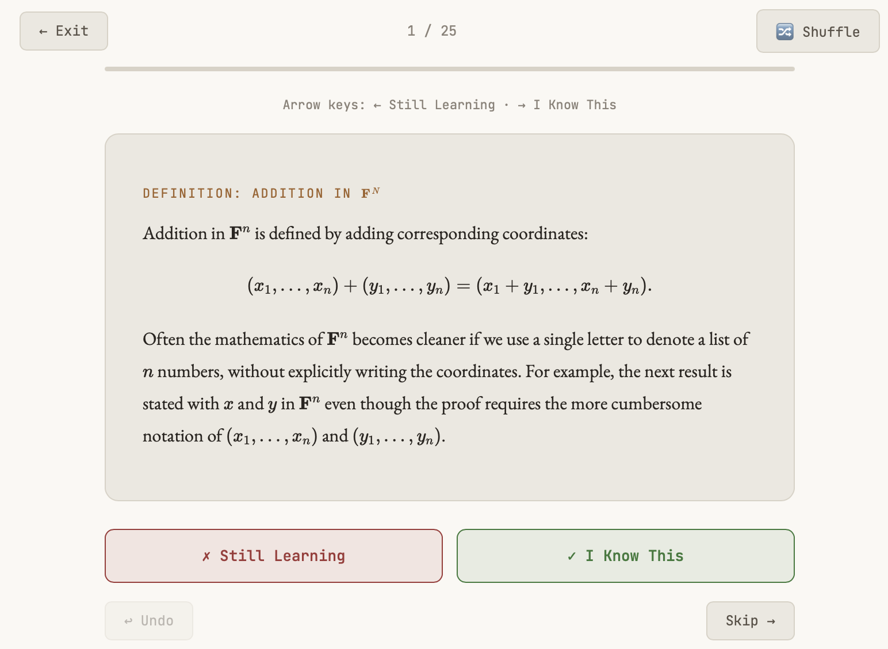
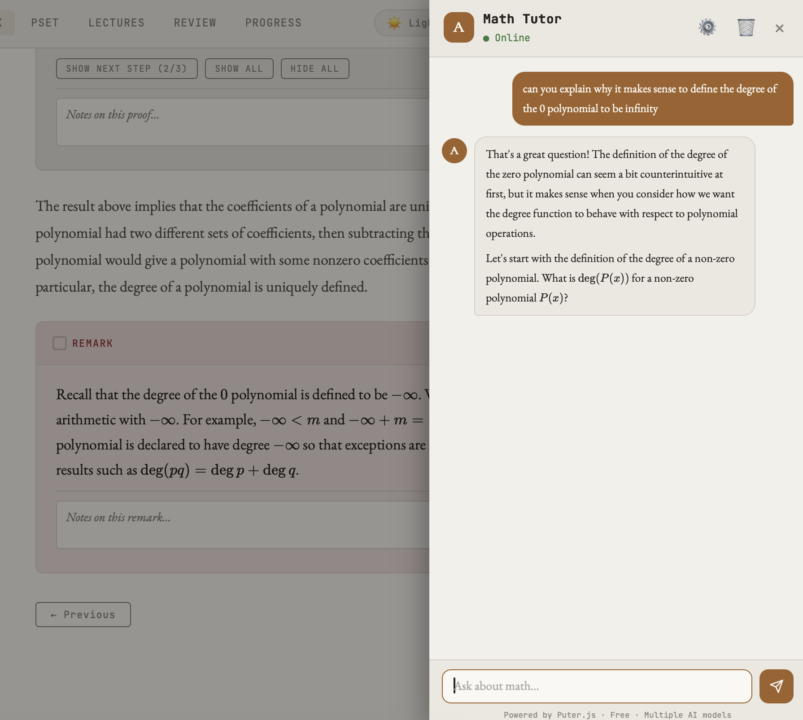
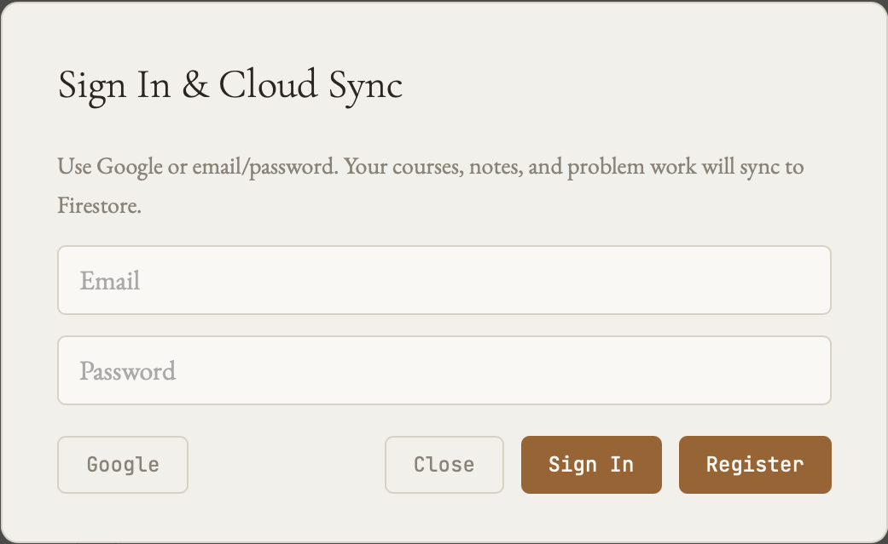

  

  

  <strong>The math study environment built for active recall — lecture notes, problem sets, flashcard review, and an AI tutor, all in one place</strong>
   
  Free, ad-free, and designed for the way mathematicians actually study

  <a href="#">🚀 Open App</a> •
  <a href="#%EF%B8%8F-quick-start-tldr">📖 Quick Start</a> •
  <a href="#-frequently-asked-questions">❓ FAQ</a>

  
  
  
  

---

Hey, everyone! 👋

I built Axiom because I kept bouncing between my textbook PDFs, a scratch paper notebook, and a flashcard app — and none of them talked to each other. This is a focused math study environment designed for *active recall*: paste your lecture notes or textbook chapters as LaTeX, and Axiom structures them into definitions, theorems, lemmas, and proofs that you can reveal one at a time, take notes on, and review as flashcards. Problem sets live alongside the notes, linked to the relevant section, and an AI math tutor is one click away.

## 📋 Table of Contents
- [Quick Start](#%EF%B8%8F-quick-start-tldr)
- [Install as an App](#-install-as-an-app-pwa)
- [Features at a Glance](#-features-at-a-glance)
- [How to Use](#-how-to-use)
- [All Features](#-all-features)
- [Keyboard Shortcuts](#%EF%B8%8F-keyboard-shortcuts)
- [FAQ](#-frequently-asked-questions)
- [Tech](#-tech)
- [About This Project](#-about-this-project)

---

## ⚡️ Quick Start (TL;DR)
1. Open the app and click **"+ Course"** to add your first course (e.g. MAT 217)
2. Click **"+ Chapter"** and paste in LaTeX from your lecture notes or textbook
3. Axiom parses it into structured math blocks — definitions, theorems, proofs, exercises
4. Work through each block, reveal proofs on demand, and jot annotations inline
5. Switch to **Review** to drill the blocks as flashcards 🎉

---

## 📱 Install as an App (PWA)

Axiom is a Progressive Web App — install it on your phone or computer for a fullscreen native experience, no App Store required.

**iPhone/iPad (Safari):**
1. Open the app in Safari
2. Tap the **Share** button (square with arrow)
3. Scroll down and tap **"Add to Home Screen"**
4. Toggle **"Open as Web App"** ON
5. Tap **Add** — launches fullscreen like a real app!

**Android (Chrome):**
1. Open the app in Chrome
2. Tap the **three-dot menu** → **"Add to Home Screen"** or **"Install App"**

**Desktop (Chrome/Edge):**
1. Look for the **install icon (⊕)** in the address bar
2. Click **"Install"**

Your data saves locally and syncs to the cloud if you sign in — so you won't lose your notes even after installing.

---

## ✨ Features at a Glance

| Feature | Description |
|---------|-------------|
| 📖 **LaTeX Reader** | Paste any `.tex` source and Axiom renders it with full KaTeX math support |
| 🧩 **Active Recall Blocks** | Definitions, theorems, lemmas, proofs, corollaries, and exercises — each collapsible |
| 🔗 **Clickable Cross-References** | `\ref{}`, `\eqref{}`, and bare Axler-style numbers (e.g. `3.21`, `(4.10)`) open instant preview popups |
| 🗒️ **Inline Annotations** | Write notes directly on any math block; they persist alongside the content |
| 📝 **Problem Sets** | Organize homework and practice problems, link them to textbook sections |
| 🃏 **Flashcard Review** | Drill all your blocks as cards with know / still-learning tracking |
| 💬 **AI Math Tutor** | Context-aware chat that knows which course and section you're studying |
| 📊 **Progress Tracking** | Study streaks, sections completed, problems solved — with a 30-day calendar |
| ☁️ **Cloud Sync** | Sign in with Google or email to sync across all your devices |
| 💯 **100% Free** | No ads, no paywalls, no subscriptions |

---

## 🚀 How to Use

### Step 1: Add a Course

  

Click **"+ Course"** in the sidebar and enter the course code (e.g. `MAT 217`) and full name (e.g. `Honors Linear Algebra`). Each course gets its own section in the sidebar and its own color-coded progress tracker.

### Step 2: Load Your Lecture Notes

  

Click **"+ Chapter"** and either:
- **Paste LaTeX** directly from your notes or textbook source
- **Upload a `.tex` file** by clicking the File tab or dragging it onto the drop zone

Axiom parses standard LaTeX environments — `\begin{definition}`, `\begin{theorem}`, `\begin{proof}`, `\begin{lemma}`, `\begin{corollary}`, `\begin{exercise}` — and renders each one as a structured, collapsible block.

**Pro tip:** You can also drag and drop a `.tex` file anywhere onto the main area to load it instantly.

### Step 3: Study with Active Recall

  

Each theorem, definition, and proof renders as a card with a **Reveal** button. Work through the material actively:
- Read the statement, try to recall the proof, then click **Reveal** to check yourself
- Click the **✓ checkbox** to mark a block as read — the TOC dot turns green
- Use the **Edit** button to tweak the LaTeX source directly if there's a typo
- Add **annotations** in the text area below any block — saved automatically
- **Click any cross-reference** (`Theorem 3.21`, `(4.10)`, `by 1.34`) to instantly preview that result in a popup — no scrolling required

### Step 4: Work Problem Sets

  

Switch to the **P-Sets** tab to manage your homework and practice problems.

1. Click **"New Problem Set"** and name it (e.g. `Homework 3`)
2. Add problems by pasting LaTeX/text or uploading a `.tex` / `.txt` file
3. Optionally link problems to a textbook section for easy cross-reference
4. For each problem, write your work in the scratch area and mark it **Done** or **Stuck**
5. Drag problems to reorder them

### Step 5: Review as Flashcards

  

Switch to the **Review** tab to drill your math blocks as flashcards.

- The **front** of each card shows the block type and title (e.g. *Theorem 3.2*)
- Click the card to **flip** it and see the full content
- Mark each card as **Know** ✓ or **Still Learning** ✗
- Filter by chapter or review all courses at once
- Session stats (total, known, remaining) shown at the top

### Step 6: Ask the AI Tutor

  

Click the **💬 button** in the bottom-right corner to open the AI math tutor. The tutor knows which course and section you're currently studying, so you can ask things like:

- *"Can you give me an example of this theorem?"*
- *"I'm stuck on Exercise 1A.3 — can you give me a hint without spoiling it?"*
- *"Explain the intuition behind this proof."*

Switch between models in the chat settings ⚙️ if needed.

### Step 7: Sign In for Cloud Sync *(Optional)*

  

Click **Sign In** in the top bar to sign in with Google or email/password. This syncs your courses, notes, annotations, and problem work to Firebase in real time — so you can pick up where you left off on any device.

---

## ✨ All Features

<strong>📖 LaTeX Reader</strong>

 

- **Paste or upload** `.tex` source — drag and drop anywhere on the main area
- **KaTeX rendering** for inline and display math, including complex environments
- **Full custom macro support** — `\inp`, `\norm`, `\abs`, `\nullsp`, `\range`, `\spa`, `\F`, `\R`, `\C`, and more, all render correctly everywhere including popups
- **Multi-chapter support** — add as many chapters as you need per course, reorder via the TOC
- **Section & subsection parsing** — generates a navigable table of contents automatically
- **Edit mode** — click Edit on any block to modify the raw LaTeX and re-render
- **Delete chapters** — hover a chapter in the TOC to reveal the delete button

<strong>🔗 Clickable Cross-References</strong>

 

Axiom turns every cross-reference in your LaTeX into a live, clickable link — no more scrolling back to find what `3.21` refers to.

- **`\ref{thm:4.6}`** → renders as `Theorem 4.6` with an underline; click to see a full popup preview of that theorem, definition, lemma, or corollary
- **`\eqref{eq:4.10}`** → renders as `(4.10)` in blue; click to flash and scroll to the equation
- **Bare Axler-style numbers** — patterns like `by 3.21`, `see 1.34`, `(3.4)` in prose automatically become clickable links when the referenced block exists in your loaded chapters
- **Popup previews** show the full KaTeX-rendered content of the referenced block, with a "Jump to source" button to navigate directly to it
- Works across chapters — references from Chapter 6 can pop up items from Chapter 3

<strong>🧩 Math Block Types</strong>

 

Axiom recognizes and color-codes the following LaTeX environments:

| Environment | Color | Reveal Button |
|-------------|-------|--------------|
| `definition` | Amber | — (always visible) |
| `theorem` | Blue | ✓ |
| `lemma` | Purple | ✓ |
| `proof` | Gray | ✓ |
| `corollary` | Red | ✓ |
| `exercise` | Green | ✓ |

Each block has its own **read checkbox**, **annotation field**, and **edit button**.

<strong>🗒️ Notes</strong>

 

- Switch to the **Notes** tab for a free-form scratch pad per course
- Notes are separate from block annotations — great for summary sheets or exam prep
- KaTeX renders math in notes automatically
- Notes sync to the cloud with the rest of your data

<strong>📝 Problem Sets</strong>

 

- Create named problem sets (e.g. `Homework 1`, `Practice Final`)
- Parse problems from pasted text or uploaded `.txt` / `.tex` files — Axiom auto-detects `Exercise`, `Problem`, or numbered problems like `1.`
- **Link problems to a textbook section** — click the section tag to jump straight there
- **Scratch work area** per problem for your attempts, with KaTeX rendering
- Mark problems as **Done** (green) or **Stuck** (red)
- **Drag to reorder** problems within a set

<strong>🃏 Flashcard Review</strong>

 

- **Flip cards** to reveal the full block content
- **Know / Still Learning** rating — tracks your session stats
- **Chapter filter** — review one chapter or all at once
- **Progress bar** shows how far through the deck you are
- **Keyboard shortcuts**: `Space` to flip, `←` / `→` to navigate, `1` for Still Learning, `2` for Know
- **Swipe animations** on mobile

<strong>💬 AI Math Tutor</strong>

 

- Powered by Puter AI — no API key needed, free to use
- **Context-aware** — the system prompt includes your current course, chapter, and section
- **Conversation history** preserved within a session
- **Model switcher** in chat settings ⚙️
- KaTeX renders math in tutor responses
- Online / offline status indicator

<strong>📊 Progress & Streaks</strong>

 

- **Study streak** — counts consecutive days you've opened the app
- **30-day activity calendar** — visual heatmap of your study days
- **Sections read** and **problems solved** counters
- **Per-course progress bars** — shows sections completed out of total

<strong>☁️ Sync & Persistence</strong>

 

- **localStorage** — all data saved locally in your browser automatically, no sign-in required
- **Firebase sync** — sign in with Google or email/password to back up and sync across all your devices in real time
- **Export/Import** — download your data as JSON; import it back on any device
- **Offline-capable** — works without an internet connection once loaded

<strong>🎨 Personalization</strong>

 

- **Dark / Light** themes — toggle in the top bar
- **Per-course colors** — each course gets a color dot in the sidebar
- **Collapsible sidebar** — more room for reading on smaller screens
- **Mobile-responsive** — sidebar auto-collapses on small screens with a hamburger menu

---

## ⌨️ Keyboard Shortcuts

| Key | Action |
|-----|--------|
| `Esc` | Close any open modal |
| `Space` | Flip flashcard (in Review mode) |
| `←` `→` | Navigate flashcards |
| `1` | Mark card "Still Learning" |
| `2` | Mark card "Know" |

---

## ❓ Frequently Asked Questions

### 🚀 Getting Started

<strong>Do I need to make an account?</strong>

 
Nope! Axiom works fully without signing in — your data is saved automatically in your browser. Sign in with Google or email only if you want to sync across multiple devices or protect against losing data if you clear your browser.

<strong>What LaTeX environments does Axiom support?</strong>

 
Axiom parses <code>definition</code>, <code>theorem</code>, <code>lemma</code>, <code>proof</code>, <code>corollary</code>, <code>proposition</code>, <code>remark</code>, <code>example</code>, and <code>exercise</code> environments, along with <code>\section</code> and <code>\subsection</code> headings, prose paragraphs, lists, and display/inline math. Axler-style <code>\axitem{3.4}{linear map lemma}</code> blocks are also fully supported.

Cross-references via <code>\ref{}</code>, <code>\eqref{}</code>, and bare item numbers (like <code>3.21</code> or <code>(4.10)</code>) are automatically turned into clickable popup links. You can paste a raw <code>.tex</code> file and most standard math textbook formatting will render correctly.

Custom macros like <code>\inp</code>, <code>\norm</code>, <code>\abs</code>, <code>\nullsp</code>, <code>\range</code>, <code>\spa</code>, <code>\F</code>, <code>\R</code>, <code>\C</code> are all pre-defined and render everywhere, including in popup previews.

<strong>Does this work on my phone?</strong>

 
Yes! The sidebar collapses on small screens and the reader is fully scrollable. Install it as a PWA for the best experience — it'll feel just like a native app.

<strong>Can I use this offline?</strong>

 
Yes! Once the page loads, the reader, problem sets, notes, and review mode all work without an internet connection. The AI tutor requires internet access.

### 📖 Notes & Problem Sets

<strong>How do I add multiple chapters for one course?</strong>

 
Click <strong>"+ Chapter"</strong> as many times as you need. Each chapter appears as a collapsible section in the table of contents in the sidebar. You can delete a chapter by hovering its TOC header and clicking the trash icon.

<strong>How do I link a problem to a textbook section?</strong>

 
When adding problems, use the "Link to section" dropdown to associate them with a chapter section. A tag appears on each problem — click it to jump straight to that section in the reader.

<strong>Can I edit a block after loading it?</strong>

 
Yes! Click the <strong>Edit</strong> button on any block header to open a raw LaTeX editor. Save to re-render with KaTeX.

<strong>How do the clickable cross-references work?</strong>

 
When you load a chapter, Axiom builds a registry of all labeled blocks (via <code>\label{}</code>) and all Axler-style numbered items. Any <code>\ref{}</code> or <code>\eqref{}</code> in the text becomes a clickable span. Bare numbers in prose — like "by <strong>3.21</strong>" or "<strong>(4.10)</strong>" — are also detected and linked automatically.

Clicking a theorem/definition/lemma ref opens a popup with the full rendered content of that block and a "Jump to source" button. Clicking an equation ref flashes and scrolls to the equation. References work across chapters as long as both chapters are loaded.

### ☁️ Sync & Data

<strong>My data disappeared after I cleared my browser!</strong>

 
Data is stored in your browser's local storage by default. Clearing browser data will erase it. To prevent this, sign in with Google or email for cloud backup — or use Export (in settings) to download a JSON copy of your data regularly.

<strong>Can I use Axiom on my laptop and phone at the same time?</strong>

 
Yes, if you sign in with the same account on both devices. Changes sync in real time via Firebase.

<strong>What does the AI tutor have access to?</strong>

 
The tutor receives your current course name, chapter title, and active section as context — so it knows what you're studying. It does not receive your annotations, problem work, or notes.

---

## 🛠️ Tech

Zero build step. Single `index.html` — just open it in a browser.

- **KaTeX** for fast, high-quality math rendering (definitions, theorems, inline and display math)
- **Firebase** (Auth + Firestore) for optional sign-in and real-time cloud sync
- **Puter AI** for the math tutor chat (no API key required)
- **Google Fonts** — EB Garamond, Cormorant Garamond, JetBrains Mono
- **localStorage** for offline-first persistence
- **PWA-ready** — installable on any device

---

## 🙏 About This Project

Axiom was built by a Princeton student who kept losing track of which theorems they'd actually internalized versus just read past. The goal was something that would make *active recall* the default — not an afterthought — when working through dense math material.

**Note:** The app is still a work in progress and may have rough edges. If you find bugs or have feature suggestions, please reach out at **lw3319@princeton.edu** — feedback genuinely helps!

The app is open source and free to use or adapt. If you find it useful, share it with your classmates!

**Good luck this semester. Go Tigers! 🐯**

---

## 🚧 Known Limitations & Future Ideas

<strong>Current Limitations</strong>

 

- **localStorage only without sign-in** — clearing browser data will erase local progress; sign in or export regularly to be safe
- **LaTeX parser is heuristic** — very unusual or deeply nested environments may not render perfectly; the Edit button lets you fix anything manually
- **Cross-references require loaded chapters** — `\ref{}` popups only work for blocks in chapters currently loaded in the app; references to unloaded chapters show nothing
- **No push notifications** — no reminders for upcoming problem set deadlines
- **AI tutor requires internet** — offline mode does not include the chat feature

<strong>Possible Future Features (Maybe!)</strong>

 

- 🔔 Problem set deadline reminders
- 📤 Export flashcard decks to Anki
- 🔗 Import directly from a URL (arXiv, course websites)
- 📊 Spaced repetition scheduling for flashcard review
- 🤝 Share a course's notes with classmates

*Note: This is a student project maintained during the semester. Updates may be sporadic!*

---

*Perfect for: Real analysis • Linear algebra • Abstract algebra • Topology • Any proof-based math course*

*Made by Lillian Wang · Princeton University · Spring 2026*
